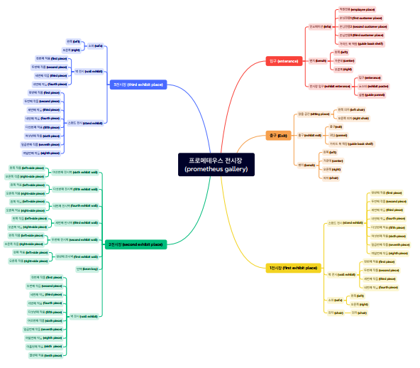
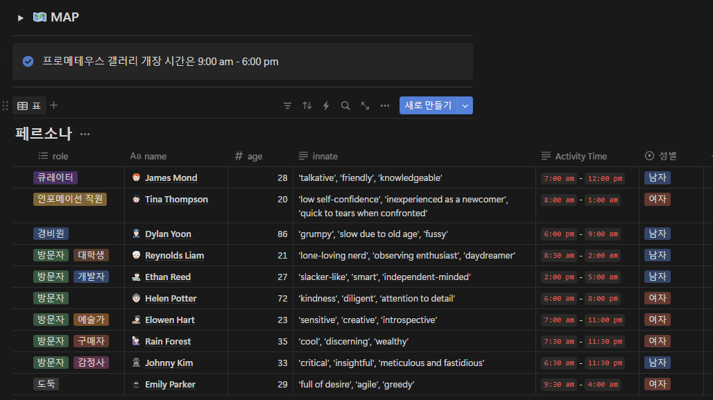

## 2024-1 Prometheous Generative Agent Main Repository

## Topic: Virtual World 상에서 서로 상호작용하는 NPC 세계 만들기

## Project Overview
- NPC들이 서로 상호작용하는 가상 세계를 backend 상에서 구현한 뒤, FastAPI를 통해 Zep frontend 상에서 시각화하였습니다. 자세한 내용은 다음과 같습니다.
- 왼쪽 그림과 같은 원본 가상 세계에, 오른쪽 그림과 같은 박물관을 추가하였습니다. 박물관 내부에는 저희 동아리를 소개하는 작품들이 전시되어 있습니다.

<div style="display: flex;">
  
  
</div>


## Demo
- 실제 시연 영상입니다. NPC들이 The Ville라는 원본 가상 세계에서 새로 추가된 Museum을 방문하는 모습입니다. 
[Video](Video_Link)
- Json 파일 예시입니다. NPC들이 박물관에 도착하여, 서로 상호작용 하고 있는 모습입니다.
```json
{
  {
    "James Mond": {
      "movement": [
        62,
        46
      ],
      "pronunciatio": "\ud83d\ude42",
      "description": "heading to the gallery and opening for the day @ the Ville:Gallery:enterance infor:employee place",
      "chat": null
    },
    "Rain Forest": {
      "movement": [
        57,
        30
      ],
      "pronunciatio": "\ud83d\ude42",
      "description": "discussing potential artworks with Johnny Kim (asking Johnny Kim questions about the artists and their backgrounds) @ the Ville:Gallery:enterance infor:guide book shelf",
      "chat": null
    },
    "Tina Thompson": {
      "movement": [
        62,
        46
      ],
      "pronunciatio": "\ud83d\ude42",
      "description": "arriving at the gallery and starting her shift at the information desk @ the Ville:Gallery:enterance infor:employee place",
      "chat": null
    }
  },
  "meta": {
    "curr_time": "February 13, 2023, 10:16:15"
  }
}
```


## Study/Project Process
- [Notion](https://www.notion.so/Generative-Agent-Project-fd2058e966d84030aece6a139c9d7361) 프로젝트 진행 과정을 담은 Notion 페이지입니다.
- [PPT](???) 프로젝트 월간 발표 및 최종 발표자료입니다.


## Updated Note
### 원본 코드의 프론트엔드 부분을 제거하고, Zep을 사용하여 프론트엔드를 구현하였습니다.
- Explanation
### 박물관 세계를 원본 코드 형식에 맞게 CSV/Json 형태로 작성하여 추가하였습니다.
- 새롭게 추가된 Museum 구조는 다음과 같습니다.
> 
### NPC들의 페르소나를 새롭게 구성한 뒤, 가상 세계 상에서 상호작용 하는 모습을 관찰하였습니다.
- 다음과 같은 페르소나를 구성하였습니다.
> 
### Zep과 원본 코드를 FastAPI를 통해 연결하였습니다.
- Explanation


## How to Start
- 다음 명령어를 통해 Backend를 시작합니다.
```bash
cd backend/reverie
python reverie.py
```
- **이후 내용 작성하기**


## Reference
- Generative Agents: Interactive Simulacra of Human Behavior 해당 논문 및 github 자료를 참고하였습니다.
- original code: https://github.com/joonspk-research/generative_agents.git

## Contributors
- Prometeus 5기 신우림 ([github](https://github.com/Rainwoorimforest))
- Prometeus 4기 유동균 ([github](https://github.com/yoodonggyun-github))
- Prometeus 3기 박은주 ([github](https://github.com/enjprk41))
- Prometeus 3기 모진호 ([github](https://github.com/JinhoMo))
- Prometeus 2기 김종효 ([github](https://github.com/naye971012))