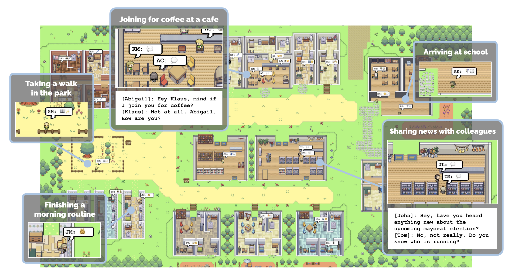
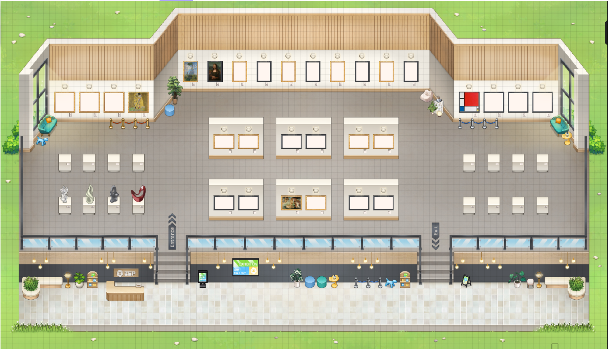

## 2024-1 Prometheous Generative Agent Main Repository

## Topic: Virtual World 상에서 서로 상호작용하는 NPC 세계 만들기

## Project Overview
- NPC들이 서로 상호작용하는 가상 세계를 backend 상에서 구현한 뒤, FastAPI를 통해 Zep frontend 상에서 시각화하였습니다. 자세한 내용은 다음과 같습니다.
- 왼쪽 그림과 같은 원본 가상 세계에, 오른쪽 그림과 같은 박물관을 추가하였습니다. 박물관 내부에는 저희 동아리를 소개하는 작품들이 전시되어 있습니다.

  
  

## Demo Video
- 실제 시연 영상입니다. NPC들이 The Ville라는 원본 가상 세계에서 새로 추가된 Museum을 방문하는 모습입니다. 
[Video](Video_Link)

## Study/Project Process
- [Notion](https://www.notion.so/Generative-Agent-Project-fd2058e966d84030aece6a139c9d7361) 프로젝트 진행 과정을 담은 Notion 페이지입니다.
- [PPT](???) 프로젝트 월간 발표 및 최종 발표자료입니다.

## Reference
- Generative Agents: Interactive Simulacra of Human Behavior 해당 논문 및 github 자료를 참고하였습니다.
- original code: https://github.com/joonspk-research/generative_agents.git

## Contributors
- Prometeus 5기 신우림 ([github](https://github.com/Rainwoorimforest))
- Prometeus 4기 유동균 ([github](https://github.com/yoodonggyun-github))
- Prometeus 3기 박은주 ([github](https://github.com/enjprk41))
- Prometeus 3기 모진호 ([github](https://github.com/JinhoMo))
- Prometeus 2기 김종효 ([github](https://github.com/naye971012))